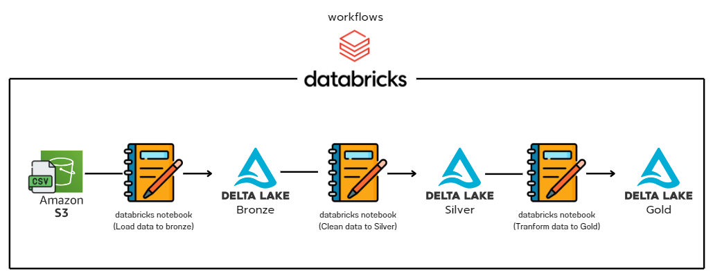
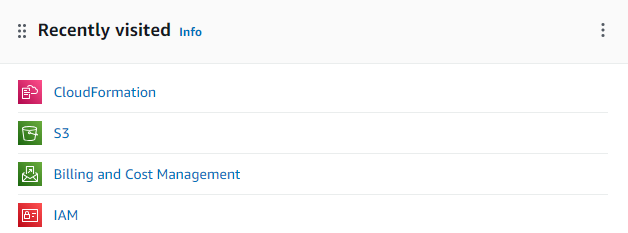
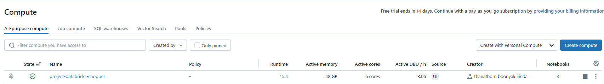
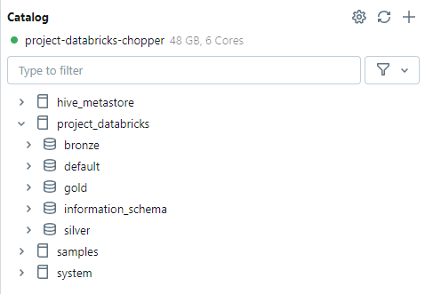
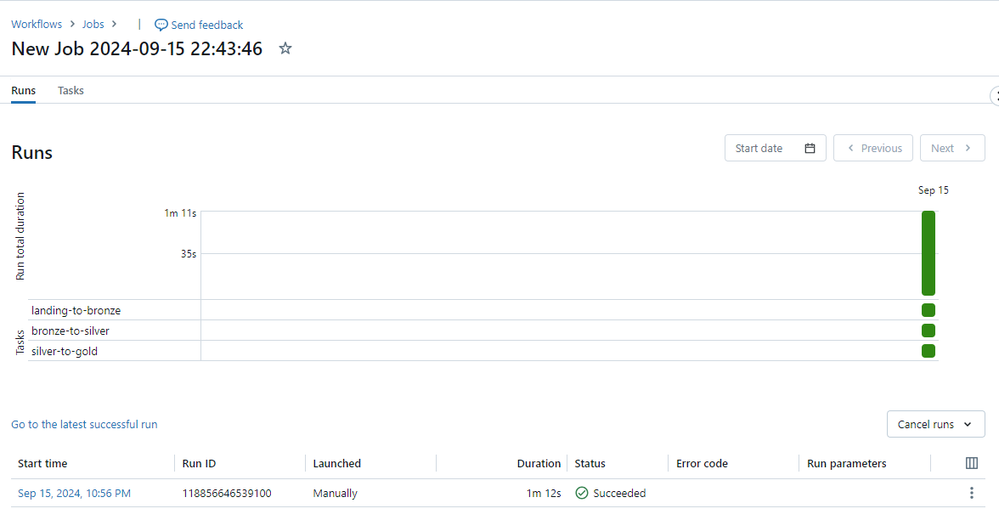
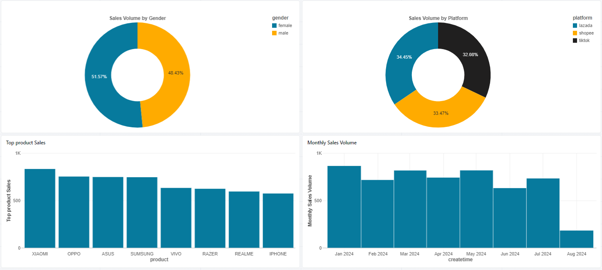

# Aws and Databricks

## Objective
This project showcases the various functions of Databricks and AWS, as well as performing ETL (Extract, Transform, Load) using Databricks and AWS.

## Components
1. **Amazon S3 bucket**:
   - Used as a storage repository.
   - Data is stored as CSV files.
   - known as a Data Lake.

2. **Databricks**:
   - Used to programming in Python , Linux and SQL
   - Delta Lake is used for data storage, making it more space-efficient and improving performance.
   - Create workflows to automatically run notebooks.
   - Create a dashboard to display data within itself.
   - known as a Data Lakehouse

## Configure S3 and Databricks
1. **Configuring IAM for S3AllAccess Permissions on AWS IAM**:
   - first create user in AWS IAM.
   - Permission Policies = “AmazonS3FullAccess”
   - get Access key and Secret access key

2. **Connect Cloud Formation**:
   - Set up the Databricks workspace by selecting Databricks to connect with databricks on AWS
   

       
        
       <i>After following the steps above, you will get the result as shown in the image.</i>
   

3. **Create Databricks Cluster**:
    - Typically, a Data Lake is used solely for data storage. If we want the Data Lake to also handle processing (Data Lakehouse)
    , we need to create a Cluster.
    - Databricks Cluster is use All purpose cluster.
   

       
        
       <i>After following the steps above, you will get the result as shown in the image.</i>
   

4. **Databricks Notebook**:
    - First project01-secrets.py , contains code to securely manage secrets and tokens.
    - Second project02-connectS3.py , uses the secrets from project01 to connect and access S3 and mount S3 with DBFS.
    - Third project03-Data to delta lake Bronze.py , retrieves CSV data from DBFS and exports it to Delta Lake Bronze.
    - Forth project04-Data to delta lake Silver.py , uses Databricks SQL retrieves data from Delta Lake Bronze ,
    cleans the data , and then exports it to Delta Lake Silver.
    - Fivth project05-Data to delta lake Gold.py , ses Databricks SQL retrieves data from Delta Lake Silver ,
    After cleaning the data, merge it into a single file for analysis. and then exports it to Delta Lake Gold.
   
   

       
        
       <i>Example of Delta Lake.</i>
   

 
5. **Databricks Workflows**:
    - Create Databricks workflows and configure them to run the notebooks in sequence from 03 to 05
    - It Can setup Schedules to run job.
   

       
        
       <i>Here is a workflow job that has completed successfully.</i>
   

## Result dashboard with Delta Lake Gold
