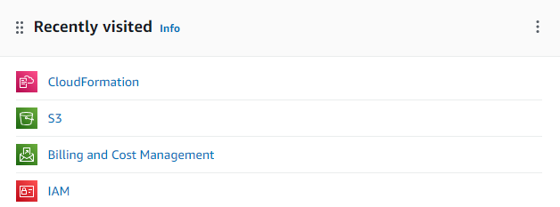

# Aws and Databricks

## Objective
This project showcases the various functions of Databricks and AWS, as well as performing ETL (Extract, Transform, Load) using Databricks and AWS.

## Components
1. **Amazon S3 bucket**:
   - Used as a storage repository.
   - Data is stored as CSV files.
   - known as a Data Lake.

2. **Databricks**:
   - Used to programming in Python , Linux and SQL
   - Delta Lake is used for data storage, making it more space-efficient and improving performance.
   - Create workflows to automatically run notebooks.
   - Create a dashboard to display data within itself.
   - known as a Data Lakehouse

## Configure S3 and Databricks
1. **Configuring IAM for S3AllAccess Permissions on AWS IAM**:
   - first create user in AWS IAM.
   - Permission Policies = “AmazonS3FullAccess”
   - get Access key and Secret access key

2. **Connect Cloud Formation**:
   - Set up the Databricks workspace by selecting Databricks to connect with databricks on AWS

After following the steps above, you will get the result as shown in the image.